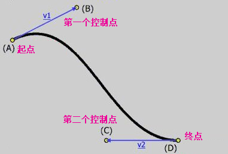

#Canvas

>canvas元素是HTML5新增的一个重要元素，专门用来绘制图形。canvas元素就是一块画布，只需要给它指定3个属性即可：id、width和height。在其中利用JavaScript进行绘画。

##绘制矩形：

1.  取得canvas元素

2.  取得上下文(context):绘图上下文是一个封装了很多绘图功能的对象。需要使用canvas对象的getContext方法来获得图形上下文，其中的参数只有2d。

3.  填充与绘制边框：用canvas元素绘制图形时，有两种方式——填充(fill)与绘制边框(stroke)。填充指填充图形内部；绘制边框是指不填满图形内部，只绘制图形的外框。

4.  设定绘制样式：绘图的样式，只要是针对图形的颜色而言的，但是并不限于图形的颜色。例如：

    * 设定填充图形的样式：fillStyle属性————填充的样式，在该属性中填入填充的颜色值。
    * 设定图形边框的样式：strokeStyle属性————图形边框的样式，在该属性中填入边框的颜色值。

5.  指定线宽：使用图形上下文对象的lineWidth属性设置图形边框的宽度。

6.  指定颜色值：绘制时填充的颜色或边框的颜色分别通过fillStyle属性与strokeStyle属性来指定。

7.  绘制矩形：分别使用fillRect方法与strokeRect方法来填充矩形或绘制矩形边框。这两个方法的定义如下所示。

        context.fillRect(x,y,width,height)
        context.strokeRect(x,y,width,height)
        contex.clearRect(x,y,width,height)    用于擦除指定的矩形区域中的图形，使得矩形区域中的颜色全部变为透明

  x是指矩形起点的横坐标，y是指矩形起点的纵坐标，坐标原点为canvas画布的最左上角，width是指矩形的长度，height是指矩形的高度。
  
具体绘制矩形的代码：
        
        <canvas id="canvas" width="500" height="400"></canvas>
        
        var canvas = document.getElementById('canvas');
	    var context = canvas.getContext("2d");
	    context.fillStyle = "#eeeeff";
	    context.fillRect(0,0,200,200);
    	context.fillStyle = "red";
    	context.strokeStyle = "blue";
    	context.lineWidth = 1;
    	context.fillRect(50,50,100,100);
    	context.strokeRect(50,50,100,100);

##使用路径   绘制圆形
要想绘制其他图形，需要使用路径。

步骤：

1. 取得图形上下文
2. 开始创建路径
3. 创建图形的路径
4. 路径创建完成后，关闭路径
5. 设定绘制样式，调用绘制方法，绘制路径

方法：

**开始创建路径：**使用图形上下文对象的beginPath方法。

    context.beginPath();

该方法不使用参数。通过调用该方法，开始路径的创建。

**创建圆形路径：**创建圆形路径时，需要使用图形上下文对象的arc方法。该方法的定义如下：

    context.arc(x,y,radius,startAngle,endAngle,anticlockwise);

x为绘制圆形的起点横坐标，y为绘制圆形的起点纵坐标，radius为圆形半径，startAngle为开始角度，endAngle为结束角度，anticlockwise为是否按顺时针方向进行绘制。arc方法不仅可以用来绘制圆形，也可以绘制圆弧。因此startAngle和endAngle是必须的，因为这两个角度决定了弧度。anticlockwise为一个布尔值的参数，true表示按顺时针绘制，false表示按逆时针方向绘制。

**关闭路径：**路径创建完成后，使用图形上下文对象的closePath方法将路径关闭。

    context.closePath();

将路径关闭后，路径的创建就完成了，但是还没有真正的绘制任何图形。

**设定绘制样式，进行图形绘制：**

    context.fillStyle = 'rgba(255,0,0,0.25)';
    context.fill();

使用创建好的路径绘制图形。在指定绘制样式时，与之前绘制矩形的绘制方法一样，使用fillStyle方法与strokeStyle方法。

绘制图形时，还使用了fill方法（也可以使用stroke方法）。这两个方法的功能为“填充图形”与“绘制图形边框”。因为路径决定了图形的大小，所以就不需要在该方法中使用参数来指定图形的大小了。

补充内容：

角(弧度)=弧长/半径；弧长=角度对应的圆周长，180度=Math.PI

注意：使用路径绘制图形必须关闭路径，否则已经创建的路径会保留，重叠绘制。

###moveTo与lineTo

绘制直线时，一般会用到moveTo与lineTo两种方法。

**moveTo：**moveTo方法的作用是将光标移动到指定坐标点，绘制直线的时候以这个坐标点为起点。该方法的定义如下所示：

    moveTo(x,y);
    x表示指定坐标点的横坐标，y表示指定坐标点的纵坐标

**lineTo：**lineTo方法在moveTo方法中指定的直线起点与参数中指定的直线终点之间绘制一条直线。该方法的定义如下所示：

    lineTo(x,y);
    x表示直线终点的横坐标，y表示直线终点的纵坐标

复杂图形绘制的代码：

    <canvas id="canvasZone" width="400" height="300"></canvas>

    var canvasZone = document.getElementById('canvasZone');
    var context2 = canvasZone.getContext("2d");
    context2.fillStyle = "#eaa8a8";
    context2.fillRect(0,0,400,300);
    var nn = 0;
    var dx = 150;
    var dy = 150;
    var s = 100;
    context2.beginPath();
    context2.fillStyle = "rgb(100,255,100)";
    context2.strokeStyle = "rgb(0,0,100)";
    var x = Math.sin(0);
    var y = Math.cos(0);
    var dig = Math.PI / 15*11;
    for(var j=0;j<30;j++){
        var x = Math.sin(j*dig);
        var y = Math.cos(j*dig);
        context2.lineTo(dx+x*s,dy+y*s);
    }
    context2.closePath();
    context2.fill();
    context2.stroke();
    

##使用bezierCurveTo绘制贝塞尔曲线

方法：context.bezierCurveTo(cp1x,cp1y,cp2x,cp2y,x,y);

绘制贝塞尔曲线，需要两个控制点，cp1x为第一个控制点的横坐标，cp1y为第一个控制点的纵坐标；cp2x为第二个控制点的横坐标，cp2y为第二个控制点的纵坐标；x为贝塞尔曲线的终点横坐标，y为贝塞尔曲线的终点纵坐标。

绘制曲线的代码：

    <canvas id="drawingCanvas" width="1000" height="1000"></canvas>
    var drawingCanvas = document.getElementById('drawingCanvas');
    var context3 = drawingCanvas.getContext("2d");
    context3.fillStyle = "#eeeeff";
    context3.fillRect(0,0,1000,1000);
    context3.moveTo(62,242);
    context3.bezierCurveTo(187,32,429,480,365,133);
    context3.stroke();

补充：控制点本身并不包含在最终的曲线里，曲线的弯曲程度由控制点与起点和重点的距离决定。距离越远，弯曲度越大。

##绘制变形图形

#坐标变化

>绘制图形的时候，我们经常会想到旋转图形，或者对图形使用变形处理，使用Canvas API的坐标轴变换处理功能，可以实现这种效果。
>在计算机上绘制图形的时候，是以坐标单位为基准来进行图形绘制的。默认情况下，Canvas画布的最左上角对应于坐标轴原点（0,0）。之前所有利用Canvas API绘制出来的图形都是以画布的最左上角为坐标轴原点，并以一个像素为一个坐标单位来进行绘制的。

如果对这个坐标使用变换处理，就可以实现图形的变形处理了。对坐标的变换处理，有以下三种方式：

1.平移：使用图形上下文对象的translate方法移动坐标轴原点。

translate方法使用两个参数————x表示将坐标轴原点向左移动多少个单位，默认情况下为像素；y表示将坐标轴原点向下移动多少个单位。

    context.translate(x,y)

2.扩大：使用图形上下文对象的scale方法将图形放大。

scale方法使用两个参数————x表示水平方向的放大倍数，y是垂直方向的放大倍数。将图形缩小时，值为0-1之间的小数。

    context.scale(x,y)

3.旋转：使用图形上下文对象的rotate方法将图形进行旋转。

rotate方法的参数angle是指旋转的角度，旋转的中心点是坐标轴的原点。旋转是以顺时针方向进行的，如果想逆时针旋转时，将angle的值设为负数即可。

    context.rotate(angle)

案例代码：

    <canvas id="drawingCanvas1" width="1000" height="1000"></canvas>
    var drawingCanvas1 = document.getElementById('drawingCanvas1');
    var context4 = drawingCanvas1.getContext("2d");
    context4.fillStyle = "#eeeeff";
    context4.fillRect(0,0,500,500);
    context4.translate(200,50);
    context4.fillStyle = "rgba(255,0,0,0.25)";
    for(var u=0;u<50;u++){
        context4.translate(25,25);
        context4.scale(0.95,0.95);
        context4.rotate(Math.PI / 10);
        context4.fillRect(0,0,100,50);
    }
